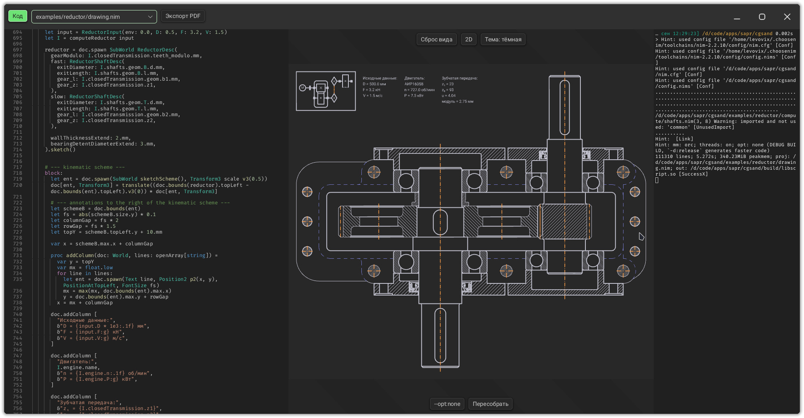
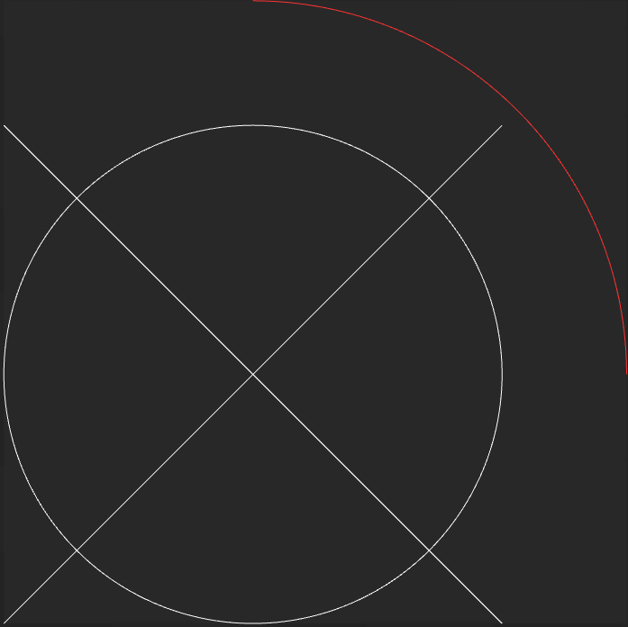
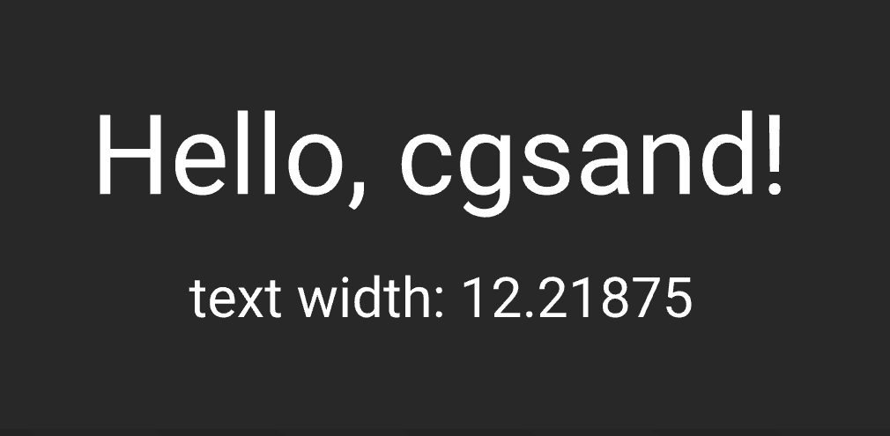
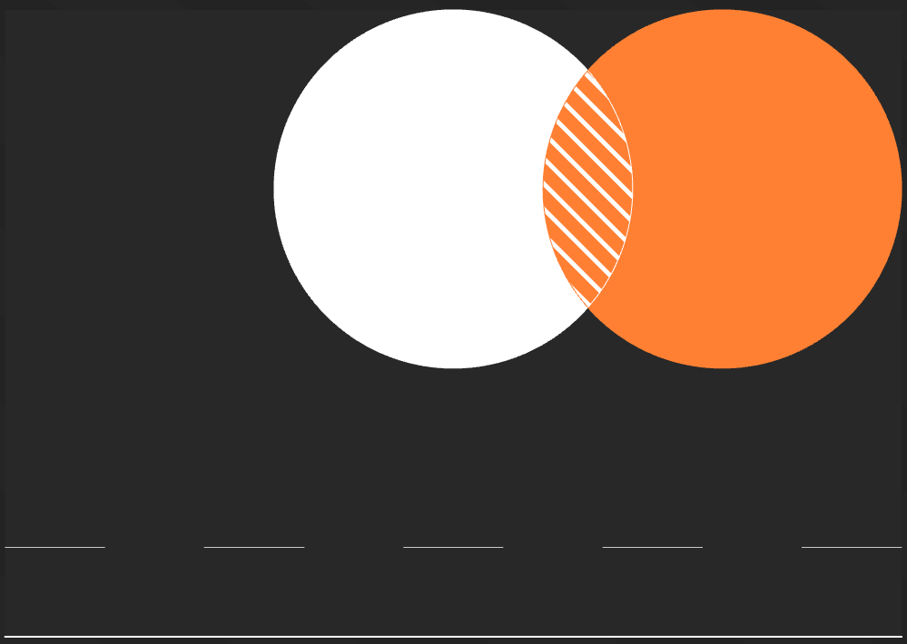
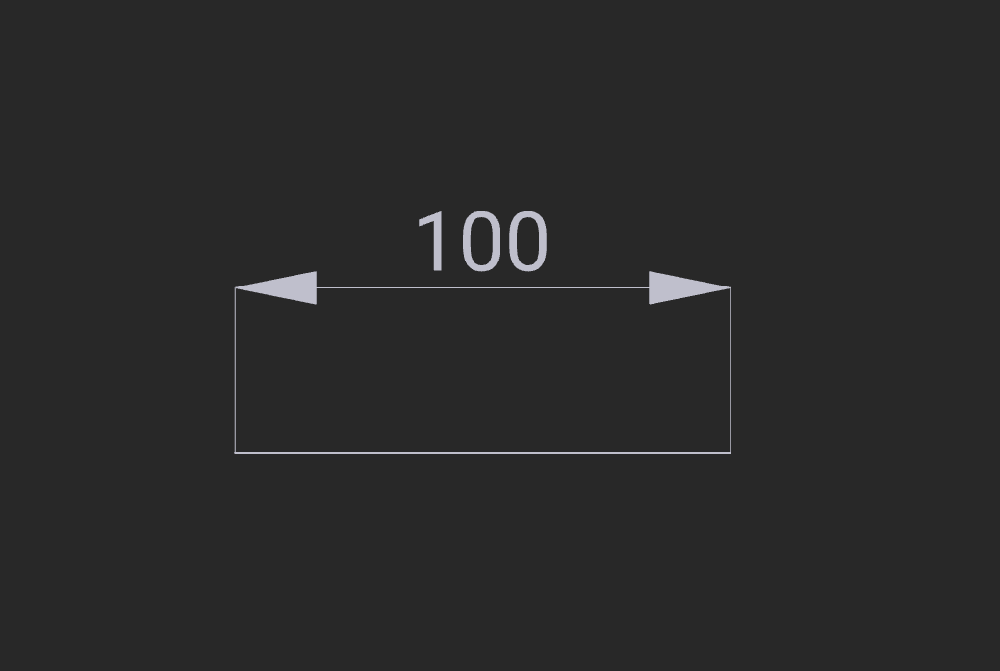
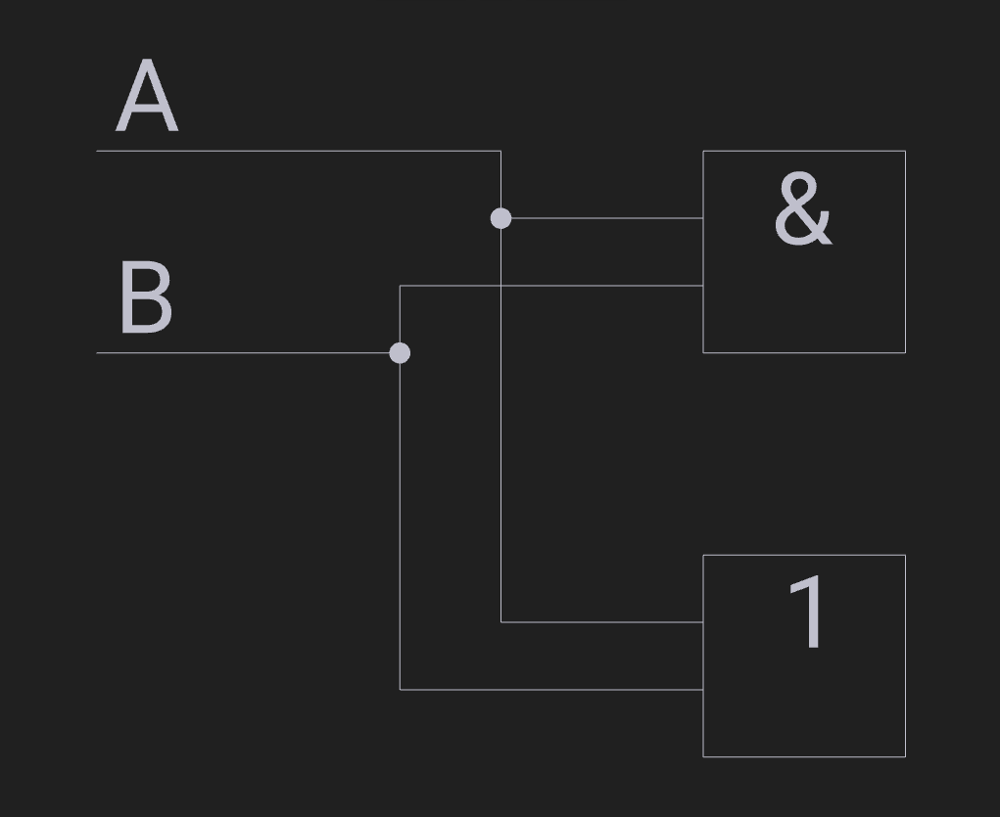
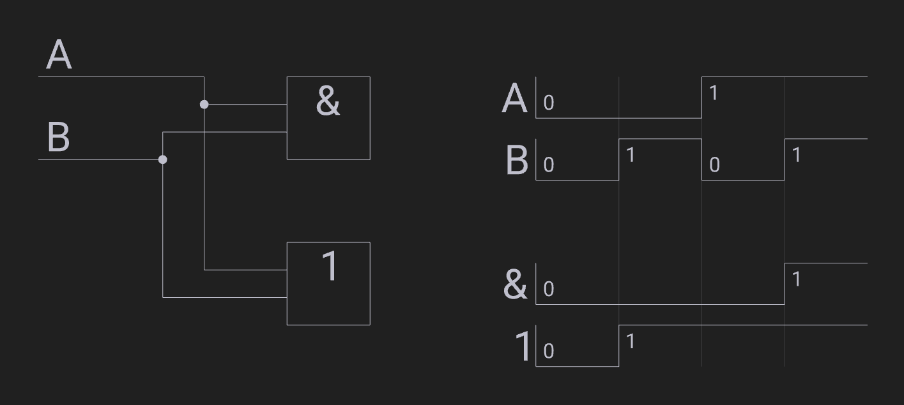
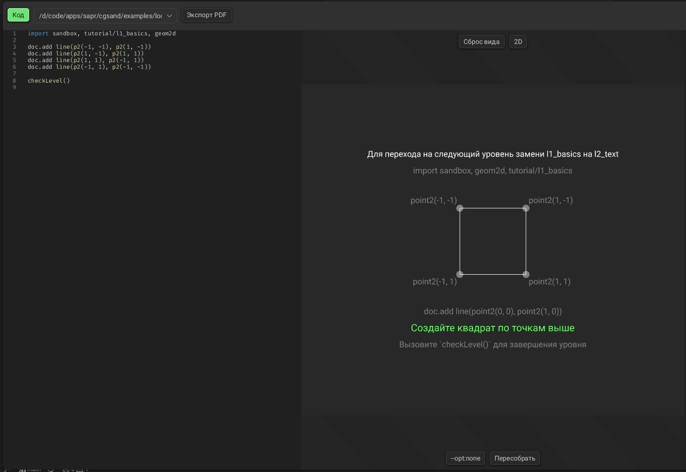

# cgsand

*In active development, do not use*

cgsand (**C**ode-**G**eometry **Sand**box) is a CAD / IDE / Game engine application written in pure Nim.



library stack:
- [sigeo](https://github.com/levovix0/sigeo) - geometry kernel
- [ecs](https://github.com/levovix0/ecs) - entity-component system
- [rice](https://github.com/levovix0/rice) - GPU-accelerated rendering
- [sigui](https://github.com/levovix0/sigui) - GUI framework
- [toscel](https://github.com/levovix0/toscel) - widget library


## Table of contents
1. [Script examples](#Script-examples)
    * [Minimal](#Minimal)
    * [Text and page settings](#Text-and-page-settings)
    * [Line styles](#Line-styles)
    * [Technical drawing](#Technical-drawing)
    * [Logic schemes](#Logic-schemes)
    * [Timing diagrams](#Timing-diagrams)
    * [3D surfaces](#3D-surfaces)
    * [Interactive scripts](#Interactive-scripts)
2. [Features](#Features)
    * [The application](#The-application)
    * [How scripts work](#How-scripts-work)
    * [The document — an ECS world](#The-document--an-ECS-world)
    * [Component reference](#Component-reference)
    * [Cache — persistent state](#Cache--persistent-state)
    * [SubWorlds](#SubWorlds)
    * [PDF export](#PDF-export)
    * ["Interactive" tutorial](#Interactive-tutorial)
3. [Build](#Build)


# Script examples

see also: [examples](examples/)

## Minimal



```nim
import sandbox, geom2d

doc.add line(point2(-50, -50), point2(50, 50))
doc.add line(point2(-50, 50), point2(50, -50))

doc.add circle(point2(0, 0), 50)

doc.add arc(point2(0, 0), 75, point2(1, 0), point2(0, 1)):
  color(1, 0.2, 0.2)
```

The canvas auto-sizes to the content by default. Pan and zoom it with the mouse.

## Text and canvas settings



```nim
import sandbox, geom2d

# `globals` is the entity holding document-wide settings
doc.update globals:
  add CanvasSettings(autoSize: true, margin: v2(2))
  # add CanvasSettings_A4_Vertical
  add FontSize 1
  add AxisYUp   # Y axis points up instead of the default down

doc.add Text "Hello, cgsand!":
  Position2 point2(0, 0)
  PositionAtCenter
  FontSize 2

doc.add Text "text width: " & $textSize("Hello, cgsand!", 2).x:
  Position2 point2(0, -2)
  PositionAtTop
```

`textSize` asks the app-side renderer, so measurements match what is drawn.

## Line styles



Components in an `add` block customize the entity:

```nim
import sandbox, geom2d

doc.add line(point2(0, 0), point2(10, 0)), (PixelThickness 2, Stroke())

doc.add line(point2(0, 1), point2(10, 1)),
  (PixelThickness 0.75, Dashing(pattern: @[1, 1]), Stroke())

doc.add circle(point2(5, 5), 2), (Fill(), Hatching(angle: Pi/4, period: 0.2))

doc.add circle(point2(8, 5), 2), color(1, 0.5, 0.2), Fill()
```

`PixelThickness` stays constant on screen no matter the zoom, `Thickness` is in world units.

## techDraw module



`techDraw` sets up drawing globals on import (line widths, mm scale, light/dark palettes)

```nim
import sandbox, geom2d, techDraw

let x0 = 0.m
let x1 = 3.m

doc.add line(point2(x0, 0), point2(x1, 0)), mainLine

doc.add LinearDimension2(
  a: point2(x0, 0),
  b: point2(x1, 0),
  dir: v2(1, 0),
  dimline: point2(x0, -1.m),
), dimensionText 100, dimFontSize

doc.drawDimensions()
```

Predefined line styles: `mainLine`, `thinLine`, `hiddenLine`, `axialLine`. Units: `mm()` and `m()` convert to document units.

see also: [examples/shafts](examples/shafts), [examples/reductor](examples/reductor) — a gearbox drawing with parametric tables and bearings selected from ГОСТ 8338-75.

## electronics/schemes module



```nim
import sandbox
import electronics/schemes

let A = Node "A"
let B = Node "B"

let and1 = andN(A, B)
let or1 = orN(A, B)

placeComponents(placementRules(
  Line(origin: point2(0, 0), nodes: @[A, B], gap: 1),
  Line(origin: point2(6, 0), nodes: @[and1, or1], gap: 2),
  bus(p2(4, 0), input = A, outputs = @[and1, or1]),
  bus(p2(3, 0), input = B, outputs = @[and1, or1]),
))

drawComponents()
```

Gates: `andN`, `nandN`, `orN`, `norN`, `xorN`, `xnorN`. Wires are placed with `Line` and `bus` rules (`bus` auto-detects the input port on each target). Circuits can be wrapped into a box with `pack`/`packN`, which makes multi-bit registers and counters trivial.

see also: [examples/electronics](examples/electronics) — adders, multiplexers, decoders, triggers, shift registers.

### Timing diagrams in electronics/schemes module



`Plot` simulates the scheme and draws a timing diagram. Feedback loops are handled:

```nim
# ...

draw Plot(
  data: @[@[A, B], @[and1, or1]],
  gap: 0.5,
  groupGap: 1.5,
  timeScale: 2,
  origin: point2(12, 0),
  timestamps: @[
    PlotTimestamp(time: 0, changes: @[setVal(A, 0), setVal(B, 0)]),
    PlotTimestamp(time: 1, changes: @[setVal(B, 1)]),
    PlotTimestamp(time: 2, changes: @[setVal(B, 0), setVal(A, 1)]),
    PlotTimestamp(time: 3, changes: @[setVal(B, 1)]),
  ],
)
```

`echoPlot(...)` runs the same simulation but prints a text table to stdout instead.

## Interactive scripts

Scripts can react to window events — mouse, keyboard, ticks:

```nim
import sandbox, geom2d, techDraw, interactive
import std/[sequtils]
import sigeo/macros/[cursors]

type Rotation = V2   # type name is the cache key

letCur t: cache[].mgetOrPut(Rotation, v2(1, 0))
  # `t` is stored in cache, so the rotation persists across re-runs

let p = (0..<4).mapIt(p2() + t.rotate(Pi*2 * (it/4)))
for i in 0..<p.len:
  doc.add line(p[i], p[(i + 1) mod 4]), mainLine


ecs_system windowEvent(e: TickEvent):
  let dir =
    if left in e.window.keyboard.pressed: -1'f
    elif right in e.window.keyboard.pressed: 1'f
    else: return

  t = t.rotate(e.deltaTime.secs * Pi*2 * (1/4) * dir)
  redraw e.window
  rerunScript()

```

Callbacks available from `interactive`: `projectionMatrix()`, `viewportMatrix()`, `viewportWindowBounds()`, `unitsPerPixel()` (world units per screen pixel, for constant-on-screen sizing) and `rerunScript()`.


# How scripts work

A script is compiled by the app into a shared library (`nim c --app:lib -d:script`) and loaded. The script's library exports its document world (`doc`), the app renders it and forwards window events into the script.

The script-side API is in `src/cgsand/lib` (`sandbox`, `geom2d`, `techDraw`, `electronics/schemes`, `interactive`, `tutorial`, `tools/measurement`). These modules are compiled into both the app and every script, with component type ids synchronized via `typeids.txt`, so both sides agree on what a `Text` or `Position2` is.

Only entities with `CacheVariable + float` are synced back to cache on run; everything else in `doc` is rebuilt from scratch each run.

## The document — an ECS world

`doc` is a `World` from [ecs](https://github.com/levovix0/ecs). A drawing is a set of entities, each holding components that describe it.

```nim
doc.add circle(point2(0, 0), 10):
  Fill()
  Hatching(angle: Pi/4, period: 0.5)

doc.forEach (a: LineSection2, thickness: Thickness||1.0):
  discard

doc.update someEntity:
  add Foreground color(1, 0, 0)
  remove Fill
```

More on ECS in [ecs](https://github.com/levovix0/ecs) documentation.

## Component reference

Document-wide (added to `globals`):

- `CanvasSettings` — page `size`, `autoSize`, `margin`, `mmScale`, foreground/background colors; `CanvasSettings_A4_Vertical` / `CanvasSettings_A4_Horizontal` for paper pages
- `AxisYDown` / `AxisYUp` — Y axis direction (down by default)
- `FontSize`, `DashingScale` — defaults for the document

Per-entity:

- `Text` + `Position2` + `PositionAt*` — text, anchored at top/bottom/left/right/center/...
- `FontSize` — height of a line of text
- `Stroke` — stroke a curve; `Fill` — fill a closed curve
- `Thickness` / `PixelThickness` — line thickness in world units / screen pixels
- `Dashing(pattern: seq[float])` — periodic dash pattern (`0` length means a dot)
- `Hatching(angle, period)` — periodic hatching for fills
- `Transform3` — 3D transform, applied before `Position2`
- `Layer` — draw order (0 by default)
- `SubWorld` — render another world as a sub-canvas
- `PolygonalSurface3` — 3D polygonal surface (ref `Grid3`)
- `NoBounds` — exclude the entity from content bounds calculation
- `CacheVariable` — name an entity to persist it between runs

## SubWorlds

`SubWorld` can be used to compose multiple diffirent documents. SubWorld supports `Position2` and/or `Transform3`

```nim
let inner = newTechDraw()
withDocument inner:
  doc.add circle(point2(0, 0), 1.mm)

doc.add SubWorld inner, Position2 point2(20.mm, 0)
```

## "Interactive" tutorial



An in-program tutorial:

```nim
import sandbox, tutorial/l1_basics
```

Complete the goal shown on the canvas, call `checkLevel()`, then switch to `tutorial/l2_text` and so on. It is recommended to not look into the tutorial source code if you don't want to be spoiled.


# Build

Requires [Nim](https://nim-lang.org/) >= 2.2.4. It is recomended to use [Atlas](https://github.com/nim-lang/atlas) to build this application.

```sh
git clone https://github.com/levovix0/cgsand
cd cgsand
atlas install
nim runRelease        # build and run
# also available:
#   nim build
#   nim runRelease
#   nim update
```

Primarily developed on Linux and Windows.
